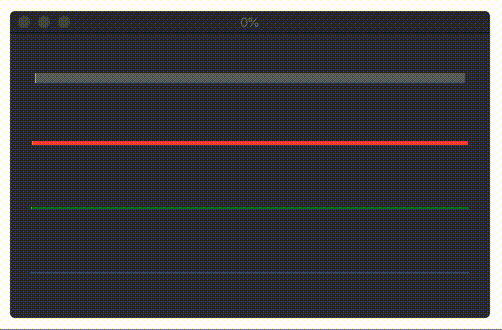

# JCGGProgressBar  
> A simple and aesthetic progress bar.

A custom control that indicates progress. Fairly customizable too.

## Installation
Clone the source and copy `JCGGProgressBar.swift` to your project.

## Use
Simply create a custom NSView and assign its class to `JCGGProgressBar`

* barColor - The color of the progress bar
* barThickness - The thickness of the progress bar
* trackColor - Color of the track
* progressValue - Progress to be displayed, from 0-100

## License
`JCGGColorSlider` is available under the MIT license. See the LICENSE file for more details.